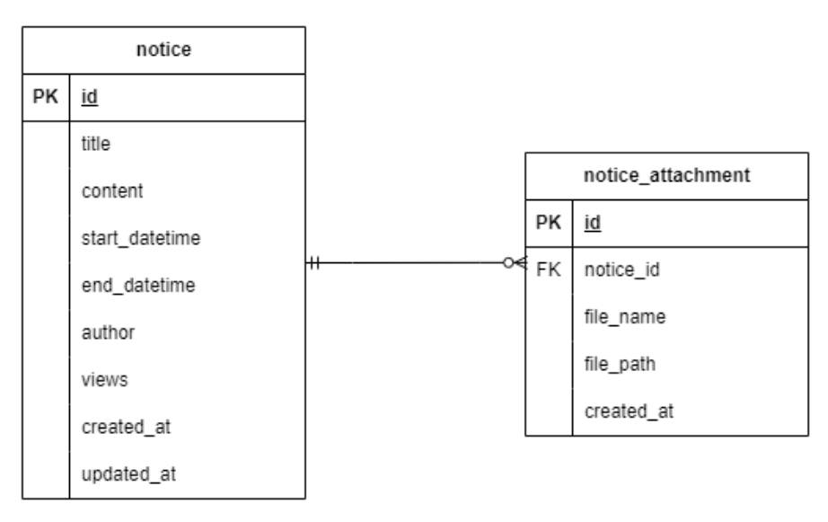

# rsupport-assignment

##  [주제] 

공지사항 관리 REST API 구현 

##  [기능 요구사항]

● 공지사항 등록, 수정, 삭제, 조회 API를 구현한다. 

● 공지사항 등록시 입력 항목은 다음과 같다.

\- 제목, 내용, 공지 시작일시, 공지 종료일시, 첨부파일 (여러개) 

● 공지사항 조회시 응답은 다음과 같다.

 \- 제목, 내용, 등록일시, 조회수, 작성자 


## 프로젝트 구성

| 기술스택    | 버전   | 비고                                                         |
| ----------- | ------ | ------------------------------------------------------------ |
| Spring Boot | 3.3.4  |                                                              |
| JDK         | 21     |                                                              |
| gradle      | 8.8    |                                                              |
| DB          | H2     | 개발 및 테스트 단계에서 별도 데이터베이스 서버를 <br />구축하지 않아도 독립적으로 개발하고 테스트 가능하므로 H2 사용 |
| Swagger-UI  | 2.2.22 |                                                              |

## Swgger-ui 

```http
http://localhost:8080/swagger-ui/index.html
```

## 데이터 설계



## API 목록

- 공지사항 공지기간 내 목록 조회

  >```http
  >GET /notices
  >```
  >
  >- request
  >
  >| 파라미터 | 설명                 |
  >| -------- | -------------------- |
  >| size     | 공지사항 목록 사이즈 |
  >| page     | 공지사항 페이지      |
  >
  >- response
  >  ```json
  >  {
  >      "success": true,
  >      "message": "성공",
  >      "data": {
  >          "content": [
  >              {
  >                  "title": "공지사항 2",
  >                  "content": "두 번째 공지사항입니다.",
  >                  "author": "Jane Doe",
  >                  "views": 5,
  >                  "startDatetime": "2024-10-05T09:00:00",
  >                  "endDatetime": "2024-10-20T18:00:00",
  >                  "createdAt": "2024-10-01T08:00:00",
  >                  "attachments": []
  >              },
  >              {
  >                  "title": "공지사항 3",
  >                  "content": "세 번째 공지사항입니다.",
  >                  "author": "Alice Smith",
  >                  "views": 15,
  >                  "startDatetime": "2024-10-10T08:00:00",
  >                  "endDatetime": "2024-10-15T18:00:00",
  >                  "createdAt": "2024-10-01T08:00:00",
  >                  "attachments": []
  >              },
  >              {
  >                  "title": "공지사항 4",
  >                  "content": "네 번째 공지사항입니다.",
  >                  "author": "Bob Johnson",
  >                  "views": 20,
  >                  "startDatetime": "2024-10-01T00:00:00",
  >                  "endDatetime": "2024-12-31T23:59:59",
  >                  "createdAt": "2024-10-01T08:00:00",
  >                  "attachments": []
  >              },
  >              {
  >                  "title": "테스트",
  >                  "content": "테스트 내용",
  >                  "author": "재권",
  >                  "views": 0,
  >                  "startDatetime": "2024-09-25T00:00:00",
  >                  "endDatetime": "2024-10-25T00:00:00",
  >                  "createdAt": "2024-10-14T15:50:17.181224",
  >                  "attachments": [
  >                      {
  >                          "fileName": "0197.jpg",
  >                          "filePath": "D:\\projects\\rsupport-assignment\\uploads\\notices\\8002d84e-25e1-4e02-8aa9-793e7b53f56d\\0197.jpg"
  >                      },
  >                      {
  >                          "fileName": "0213.jpg",
  >                          "filePath": "D:\\projects\\rsupport-assignment\\uploads\\notices\\8002d84e-25e1-4e02-8aa9-793e7b53f56d\\0213.jpg"
  >                      }
  >                  ]
  >              }
  >          ],
  >          "pageable": {
  >              "pageNumber": 0,
  >              "pageSize": 30,
  >              "sort": {
  >                  "empty": true,
  >                  "sorted": false,
  >                  "unsorted": true
  >              },
  >              "offset": 0,
  >              "paged": true,
  >              "unpaged": false
  >          },
  >          "last": true,
  >          "totalElements": 4,
  >          "totalPages": 1,
  >          "size": 30,
  >          "number": 0,
  >          "sort": {
  >              "empty": true,
  >              "sorted": false,
  >              "unsorted": true
  >          },
  >          "first": true,
  >          "numberOfElements": 4,
  >          "empty": false
  >      },
  >      "statusCode": 200
  >  }
  >  ```
  >
  >  

- 공지사항 조회
  >```http
  >GET /notices/{noticeId}
  >```
  >
  >- response
  >  ```json
  >  {
  >      "success": true,
  >      "message": "성공",
  >      "data": {
  >          "title": "공지사항 1",
  >          "content": "첫 번째 공지사항입니다.",
  >          "author": "John Doe",
  >          "views": 10,
  >          "startDatetime": "2024-10-01T08:00:00",
  >          "endDatetime": "2024-10-10T18:00:00",
  >          "createdAt": "2024-10-01T08:00:00",
  >          "attachments": null
  >      },
  >      "statusCode": 200
  >  }
  >  ```
  >
  >  

- 공지사항 등록
  >```http
  >POST /notices
  >```
  >
  >- request
  >  ```json
  >  { 
  >      "title": "테스트", 
  >      "content": "테스트 내용", 
  >      "startDatetime": "2024-09-25T00:00:00", 
  >      "endDatetime": "2024-10-25T00:00:00" , 
  >      "author": "jk"
  >  }
  >  ```
  >
  >  
  >
  >- response
  >  ```json
  >  {
  >      "success": true,
  >      "message": "성공",
  >      "data": "공지사항 등록 요청이 정상적으로 처리되었습니다.",
  >      "statusCode": 200
  >  }
  >  ```
  >
  >  

- 공지사항 변경
  >```http
  >PUT /notices/{noticeId}
  >```
  >
  >- request
  >
  >  ```json
  >  { 
  >      "title": "테스트 변경", 
  >      "content": "테스트 내용 변경", 
  >      "startDatetime": "2024-09-25T00:00:00", 
  >      "endDatetime": "2024-10-25T00:00:00" , 
  >      "author": "jk"
  >  }
  >  ```
  >
  >- response
  >  ```json
  >  {
  >      "success": true,
  >      "message": "성공",
  >      "data": {
  >          "title": "테스트 변경",
  >          "content": "테스트 내용 변경",
  >          "author": "Bob Johnson",
  >          "views": 20,
  >          "startDatetime": "2024-09-25T00:00:00",
  >          "endDatetime": "2024-09-25T00:00:00",
  >          "createdAt": "2024-10-01T08:00:00",
  >          "attachments": [
  >              {
  >                  "fileName": "0245.jpg",
  >                  "filePath": "D:\\projects\\rsupport-assignment\\uploads\\notices\\da0c36c6-d8cd-444e-9c7b-b29d19466951\\0245.jpg"
  >              }
  >          ]
  >      },
  >      "statusCode": 200
  >  }
  >  ```

- 공지사항 삭제
  >```http
  >DELETE /notices/{noticeId}
  >```
  >
  >- response
  >  ```json
  >  {
  >      "success": true,
  >      "message": "성공",
  >      "data": null,
  >      "statusCode": 200
  >  }
  >  ```

## 대용량트래픽 처리 최적화

대용량 트래픽 처리를 위한 두 가지 주요 최적화 전략을 사용. 

### 1. 공지사항 목록 조회 캐시 처리(Ehcache 사용)

>- 자주 조회되는 공지사항 목록에 대해 데이터베이스 접근을 최소화하여 응답 속도를 높이고 서버 부하를 줄인다.
>- 구현방법
>  - Ehcache를 사용하여 공지사항 목록을 캐시로 저장.
>  - Spring의 `@Cacheable` 어노테이션을 사용하여 공지사항 목록 조회 시 캐싱.
>  - 공지사항 데이터가 변경될 때는 `@CacheEvict` 어노테이션을 사용해 캐시를 무효화하여 최신 데이터 일관성을 유지.
>- Ehcache 설정
>  - ehcache.xml 파일을 통해 캐시의 만료 시간, 저장 용량 등을 설정. 

### 2. 공지사항 등록 큐를 이용한 비동기 처리

>- 대량의 공지사항 등록 요청을 서버가 부담 없이 처리할 수 있도록 비동기적으로 처리하여 응답 시간을 단축.
>- 구현 방법
>  - **ConcurrentLinkedQueue**를 이용해 공지사항 등록 요청을 큐에 저장하고, 큐에서 요청을 꺼내어 비동기적으로 처리.
>  - `ExecutorService`를 통해 큐의 요청을 별도의 스레드에서 처리하여, 서버가 응답을 빠르게 반환.
>  - 요청이 성공적으로 처리되면 `requestTrackingMap`에서 해당 요청을 제거하여 중복 처리를 방지.
>  - 큐가 가득 찬 경우 백오프(backoff) 로직을 통해 일정 시간 동안 재시도를 수행.


## 3. Redis 및 Kafka 전환 고려

- Redis 전환
  - Ehcache 대신 Redis를 사용하여 분산 캐시 환경을 구축하고, 여러 서버 간 캐시 데이터의 일관성을 보장.
  - Redis는 데이터 영속성과 높은 가용성을 제공하며, 스케일 아웃이 용이. 이를 통해 캐시의 성능을 더욱 향상시키고, 장애 복구 기능을 강화.
- Kafka 전환
  - 현재의 ConcurrentLinkedQueue를 Kafka로 전환하여, 대용량 메시지 큐를 효율적으로 처리하고 시스템 확장성을 확보
  - Kafka는 고가용성과 내구성을 가진 메시지 브로커로, 분산 환경에서 대량의 데이터를 처리하는데 최적화되어 있다.
    Kafka를 사용하면 공지사항 등록 요청을 다양한 소비자 서비스에서 처리할 수 있어, 확장성이 매우 뛰어나다.

## 참고

>- 이 프로젝트의 캐시 설정 파일은 `src/main/resources/ehcache.xml`에 위치하며, 캐시 만료 시간이나 용량과 같은 설정을 조정할 수 있다.
>- 공지사항 등록 처리와 관련된 큐 동작은 `NoticeQueueService` 클래스에서 확인할 수 있다.

## 빌드 및 실행

- 빌드
  ```bash
  # api 경로에서
  ./gradlew build
  ```

- 실행
  ```bash
  # jar 생성 위치에서
  ./java -jar ./api-0.0.1-SNAPSHOT.jar
  ```

  
